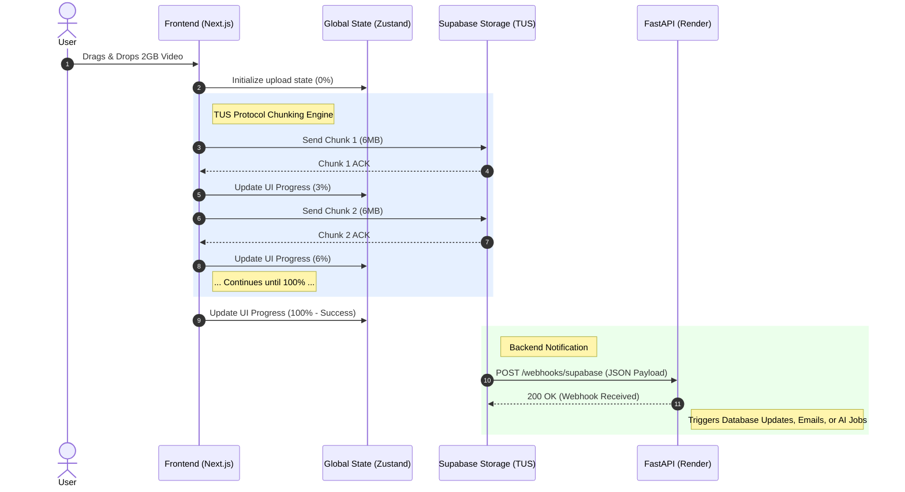

<div align="center">
  
  <h1>NexusUpload</h1>
  <p><strong>A Production-Grade, Resumable Video Upload Architecture</strong></p>
</div>

<br />

Welcome to the technical documentation for **NexusUpload**. This document provides an exhaustive, deep-dive into the architectural decisions, data flows, and state management techniques used to build a web application capable of handling massive (Gigabyte-scale) video uploads without blocking the user interface or crashing serverless functions.

---

## 🌟 1. The Core Problem & Our Solution

### The Problem with Traditional Uploads
In a standard web application, uploading large video files can be highly unreliable due to network constraints:
1. **Network Instability:** If a user on a mobile connection uploads 99% of a large video and their internet drops for one second, the entire upload fails and they must start over from 0%.
2. **Timeouts:** Standard HTTP requests often time out after 10 to 30 seconds, causing long-running video uploads to fail unexpectedly.
3. **Storage Tier Constraints:** We are currently using the **Supabase Free Tier**, which imposes a strict **50 MB limit per video upload**. While our architecture can theoretically scale to massive files, we must gracefully handle this hard server-side limit on our current free plan.

### The NexusUpload Solution
We completely decoupled the upload process from the application servers using the **TUS Protocol** and **Supabase Storage**.

1. The video file **never touches the Next.js Frontend server**.
2. The video file **never touches the FastAPI Backend server**.
3. Files are sent directly from the browser to the Supabase Storage bucket in tiny, resilient chunks.

---

## 🏗️ 2. Architectural Data Flow

The following diagram illustrates exactly how data moves through the NexusUpload system.



---

## 🚀 3. Deep Dive: The Upload Lifecycle

The primary focus of this application is the flawless execution of the upload lifecycle. Here is exactly what happens under the hood:

### Phase 1: Initiation and Chunking (`src/services/tusUploadManager.ts`)
When a user selects a file, the `tusUploadManager` (a singleton class instantiated once in the browser's memory) takes over. 
* It analyzes the file and generates a unique fingerprint based on the file's name, size, and modification date.
* It slices the massive file into precise **6 Megabyte chunks** (`chunkSize: 6 * 1024 * 1024`). This size is optimized for Supabase's API limits.

### Phase 2: The Direct-to-Storage Transfer
The browser opens a connection directly to `https://[YOUR_ID].supabase.co/storage/v1/upload/resumable`. 
* Because this is a direct browser-to-database connection, the video never touches the frontend server, removing any unnecessary middleware bottlenecks.
* If the user's internet disconnects, the TUS client automatically retries (`retryDelays: [0, 3000, 5000, 10000, 20000]`). Because of the unique fingerprint, Supabase knows exactly which chunk failed, and seamlessly resumes the upload without losing progress.

### Phase 3: Non-Blocking UI & Global State
While the network thread is busy sending chunks, the `tusUploadManager` constantly updates a global **Zustand** store (`src/store/uploadStore.ts`). 
* We placed the `<UploadStatus />` UI component inside the global `src/app/layout.tsx` file. 
* **The Result:** The user can start a massive upload, leave the home page, navigate to the Kanban board, edit their profile, and submit a contact form. The upload continues happily in the background network thread, and the progress bar follows the user across the entire application without freezing the UI or dropping a single frame.

### Phase 4: The Webhook Handshake (`backend/main.py`)
Once the final 6MB chunk is successfully written to the Supabase bucket, the file is fully assembled. 
* Supabase immediately fires a Webhook to your FastAPI backend deployed on Render.
* The backend receives a tiny JSON payload containing the `bucket_id`, `file_name`, and `size`. 
* The backend acknowledges receipt and is now free to process the file (e.g., updating a SQL database row to `status = completed`, firing an email, or queuing an AI transcription job) without ever having to hold the massive video in its own memory.

---

## 💻 4. Technology Stack Summary

| Layer | Technology | Purpose |
| :--- | :--- | :--- |
| **Frontend Framework** | Next.js (App Router) | Client-side routing, fast UI rendering, and API proxying. |
| **UI & Styling** | Tailwind CSS & Lucide-React | Beautiful, responsive, and utility-driven SVG design system. |
| **State Management** | Zustand | Lightweight, global state management outside the React tree for background uploads. |
| **Upload Engine** | `tus-js-client` | Handles chunking, resumability, and network fault tolerance. |
| **Storage / DB** | Supabase | Hosts the raw video files and triggers backend webhooks. |
| **Backend Server** | FastAPI (Python) | High-performance API for processing webhooks and sending SMTP emails. |
| **Deployment** | Vercel (FE) + Render (BE) | Optimized serverless frontend and continuous Python web service. |

---

## 📁 5. Directory Structure Map

```text
upload2/
├── backend/                     # FastAPI Python Server
│   ├── main.py                  # Webhooks, SMTP Email endpoints, and API logic
│   └── requirements.txt         # Python dependencies
├── src/                         # Next.js Frontend
│   ├── app/
│   │   ├── layout.tsx           # Global layout holding the <UploadStatus /> bar
│   │   ├── page.tsx             # Home page (The Dropzone)
│   │   ├── library/             # Media Library UI
│   │   ├── kanban/              # Task board UI (proves non-blocking routing)
│   │   └── form/                # Contact form (proxies to FastAPI)
│   ├── components/
│   │   ├── Header.tsx           # Navigation bar
│   │   └── UploadStatus.tsx     # The floating, global progress bar UI
│   ├── services/
│   │   └── tusUploadManager.ts  # The singleton engine handling TUS chunking
│   └── store/
│       └── uploadStore.ts       # Zustand state managing upload percentages
├── next.config.ts               # Proxies /api/* requests to the FastAPI backend
└── package.json
```

---

## ⚙️ 6. Configuration & Environment Variables

To run NexusUpload locally or in production, you must supply these variables.

**Frontend (`.env.local`):**
```env
# The Supabase storage endpoint for direct chunking
NEXT_PUBLIC_SUPABASE_URL=https://[YOUR_ID].supabase.co
NEXT_PUBLIC_SUPABASE_ANON_KEY=[YOUR_ANON_KEY]

# The URL of your FastAPI backend (No trailing slash)
NEXT_PUBLIC_API_URL=https://nexusupload.onrender.com
```

**Backend (`backend/.env`):**
```env
# Required for the Contact Form to send real emails
SMTP_EMAIL=your-email@gmail.com
SMTP_PASSWORD=your-app-password
```
